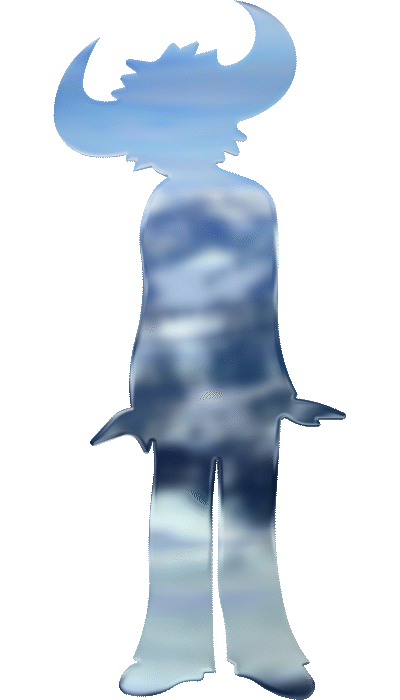

# ¡Hola! Soy Lorenzo 

### Estudiante de Programación | Full Stack Developer en formación

Me apasiona construir soluciones eficientes, minimalistas y funcionales. Actualmente curso la Tecnicatura en Programación en la **UTN FRC** y dedico mi tiempo libre a desarrollar proyectos que desafían mi lógica, desde sistemas de gestión hasta aplicaciones web.

---

### Tecnologías y Herramientas

#### Lenguajes y Backend

  
  
  
  

#### Frontend y Diseño

  
  

#### Bases de Datos

  
  
  

---

### Proyectos Destacados

*   **Ferretería Pro:** Sistema de gestión e-commerce Full Stack desarrollado con Node.js y MongoDB.

---

### Estadísticas de GitHub

  
  

  

---

### Sobre mí

*   **Enfoque:** Me gusta la disciplina, tanto en el código como en el entrenamiento físico diario.
*   **Ubicación:** Córdoba, Argentina.

